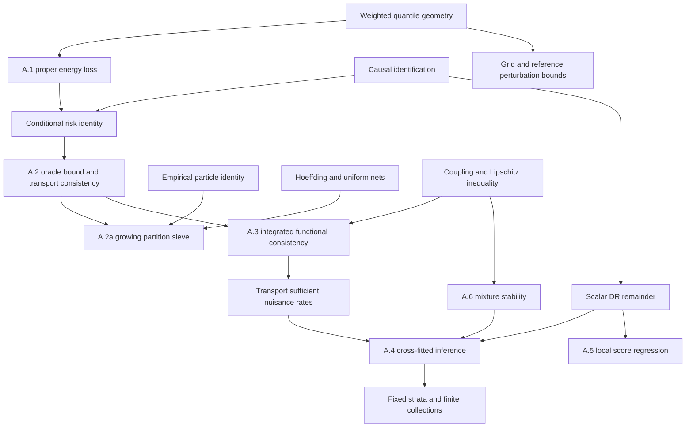

# Mathematical audit of `paper/supplement.tex`

Date: 2026-09-24. Primary audit and authorized repairs; blind review and fresh adjudication completed.

## Verdict and scope

**Overall verdict on the frozen original: MATERIAL DEFECTS FOUND.** The unrestricted risk comparison omitted an integrated moment domain, making some admissible expressions undefined; the S3 description in the main text was inconsistent with its DGP. Several citation uses also required correction or narrowing. The seven numbered results retain their conclusions and displayed rates after the documented domain repairs and proof clarifications. These are principally assumption, exposition, and attribution repairs, not counterexamples to the finite-risk inequalities or the stated inference limits.

The revised claims have been reconstructed within the scope below, including their authenticated external dependencies. All 13 mathematical source-result pairs invoked by the revised text have verified identity, relevant content, and applicability for their stated uses. The inaccessible original weighted-PAVA attribution was replaced with an inspected source. External source proofs are accepted as authenticated leaves. The empirical/code-conformity exclusions below remain substantive. Independent blind review and fresh adjudication both completed. The adjudicator classifies the corrected theory as **VALIDATED WITHIN STATED SCOPE**, with no unresolved material issue. This separate repaired-version status does not change the adverse verdict on the frozen original.

Source state: repository HEAD `b9d441398f70a993cd68d8c92e1f20da5e8560e9`; working tree already contained unrelated changes and experiment archives. The audited supplement SHA-256 was `0d7f9e61b07dda04a9c529a7883f8945ac27e9105295b82b05f48ffbf370115a`. All original files used for substantive claims are frozen in [source](source), with hashes in [source_hashes.json](source_hashes.json). The existing repository ignores `paper/`; the source snapshot and final patch retained here make these edits reviewable without changing that repository policy. No experiments were removed or ignored.

Scope: all mathematical definitions, assumptions, seven numbered results, and supporting mathematical assertions in original supplement lines 1–319; also the monotonicity, null, equal-mean-law, and moderator assertions in the DGP definitions at lines 321–394. `paper/main.tex` supplied notation and context; `TCDA/main.tex` supplied cited results. The empirical result tables, numerical study conclusions, application identification/design assumptions, and agreement of archived software with algorithm descriptions are outside this mathematical audit. Included empirical files were compiled, not independently statistically audited. Standalone claims in `TCDA/main.tex` are external leaves except their local applicability.

The parser found no theorem environments because this manuscript uses `\paragraph{Proposition ...}`. Manual reconciliation located A.1, A.2, A.2a, A.3, A.4, A.5, A.6. Their supporting unnumbered claims are explicitly covered below.

## Mathematical specification and assumptions

| ID | Content and original source | Scope, witness, use |
|---|---|---|
| D1 | Fixed integer K, positive weights summing to one; ordered cone Q_K; weighted Euclidean norm, lines 5–10 | Closed convex cone. K=1 gives R; equal-coordinate vectors give nonempty support in every K. All results. |
| D2 | Consistency, conditional exchangeability of potential outcomes, positivity, lines 12–16 | E.g. independent Bernoulli(1/2) assignment and any pair of potential vectors. Identifies each arm conditional law a.e.; never identifies the joint potential-outcome coupling. |
| D3 | Fixed measurable h, scalar mean targets and strata with p_B>0, lines 18–24 | Main text line 81 already requires integrable h; supplement now repeats E|h(Q^a)|<infinity explicitly. Lipschitz h on common compact C meets it. This repetition repairs self-contained exposition, not a missing assumption in the full paper. |
| D4 | Finite first moments of F,G for energy score, lines 76–82 | Satisfied by finite clouds and compact laws. This is pointwise in a conditional law and does not imply integrability over X. |
| H2 | iid observations, uniform overlap, deterministic particle class, approximate empirical optimization, lines 114–124 | Nonempty finite class on a fixed partition and bounded clouds is a witness. Population-risk integrability and supremum/fitted-function measurability now explicit. |
| H2C | Common compact C; U_n,b_n,o_n ->p0, lines 125–139 | Nonvacuous constant finite-cloud law/class has b_n=0, U_n ->p0, exact minimization o_n=0. Controls transport through compactness; not a hypothesis met literally by Gaussian tails. |
| H2a | X in cube, conditional W1 Lipschitz versions, deterministic cubes, growing M and J, lines 153–160 | Constant conditional laws have L_X=0. Fixed K,d, constants may depend on C,w,c,d,L_X. Global empirical minimization remains a premise. |
| H4 | Fixed independent folds; training-only nuisance fitting/tuning; overlap, EH² finite, bounded conditional residual variance; foldwise L2 consistency and product o_p(n^-1/2), lines 191–229 | Bounded outcomes and oracle nuisance functions satisfy all conditions; choose nonzero residual noise for V_h>0. No independence of overlapping training sets is assumed. |
| H5 | Independent training/evaluation, fixed interior x, nonnegative bounded compact kernel, continuous positive density/variance, Holder mean, local 2+delta moments, local score error conditions, b ->0, Nb^d ->infinity and sqrt(Nb^d)b^s ->0, lines 247–265 | Uniform covariates near x, tau constant, positive bounded residual noise, true nuisances; b=N^-alpha with 1/(d+2s)<alpha<1/d. New wording explicitly fixes deterministic bandwidth. |
| H6 | True/fitted mixture components in common bounded-diameter C containing zero; bounded h, lines 287–296 | Finite clouds and pi in [0,1]. pi=0 uses an arbitrary component convention, multiplied by zero. |
| HG | Full distributions in P2 and integrable approximation errors; fixed/reference grid maps, lines 305–319 | P2 and integrability now explicit. Grid refinement itself supplies no approximation rate. |

Notation is coherent: n is observational sample size, K outcome representation dimension, M particle count, F fold count, N independent evaluation sample size, and b bandwidth. `F` as a generic forecast law is locally scoped separately from fold count. `S_{epsilon,M}` lacked an explicit definition at first use; now tied to the one-unit summand. The weighted inner product is now defined at its first use. Positive leaf arm counts and lambda>=0 are explicit. No circular proof dependence was found.

## Dependency graph

The arrows into A.4 describe sufficient ways to meet its nuisance assumptions; A.4 does not require law consistency when regression consistency is obtained otherwise. A.5 has independent local assumptions, not a consequence of global L2 rates. Projection/backtracking establish admissibility and accepted-step descent, not the global optimization premise of A.2/A.2a.

## Complete claim coverage

Trace IDs refer to [trace_laws.md](trace_laws.md) and [trace_inference.md](trace_inference.md). `Verified locally` means the mathematics was reconstructed, with external attribution/authentication tracked separately. The status column distinguishes original source from repairs where necessary.

| Claim ID / original lines | Dependencies and proof nodes | Attacks/checks | Status and confidence |
|---|---|---|---|
| D1 weighted metric equals inner W2, 5–10 | Sorted quantile step functions; C-OT Eq 2.36 | Ties, unequal positive weights, K=1 | Verified; high |
| D2 arm-law identification, 12–16 | Consistency + exchangeability + positivity, conditional disintegration | A.e. versions, no joint coupling identified | Verified; high |
| D3 means and reference/stratum targets, 18–26 | D2, main-text integrability, expectation definitions | Infinite-mean candidate fails inherited h-integrability; nonlinear h vs mean vector | Verified with inherited condition, now repeated; high |
| ALG1 smoothed gradient, 36–50 | GRAD; differentiated both ordered pair entries | Coincident particles, unequal weights, finite differences | Verified; high |
| ALG2 leaf shrinkage, 54–65 | SHR two normal equations | lambda=0, unequal counts, linear solve | Verified; explicit domain added; high |
| ALG3 projection and descent, 67–70 | PROJ, C-PAVA | K=1, ties, cone closed/convex; no global optimum inference | Projection proof verified; algorithm attribution external; high |
| A1 strict propriety, 84–101 | A1-1:3, C-GR contextual leaf | epsilon=0 and positive, M=1, atoms, kernel integral | Verified local derivation; high |
| R-ID risk identity and identification, 103–109 | R-1:2, A1 | Infinite marginal moments with all conditional moments finite | Original integrated-risk domain incomplete; F1 repair; high |
| A2 oracle inequality, 113–124 | A2-1:2, R-ID | Nonattained infimum, empty classes, infinite risks, c factor | Valid for finite risks; original unrestricted domain ill-defined; F1; high |
| A2 compact transport implication, 125–139 | A2-3:5, C-OT | Empty separated-pair set, singleton C, escaping-tail example | Verified; empty-set branch explicit; high |
| U1 finite class and score nets, 141 | APP-1, C-H | N=1, score range, two signs, two net errors | Verified; source attribution supplied; high |
| U2 particle identity/existence, 143–148 | APP-2, A1 | All 3^3 clouds enumerated; M=1; epsilon in {0,.01,2} | Verified; high |
| U3 approximation witness and fixed-M obstruction, 148 | APP-3, compact image of C^M x simplex | Atoms, nonatomic law; a null covariate point alone does not obstruct integrated consistency | Verified with ordinary a.e. reading; high |
| U4 algorithmic scope/tail counterexample, 150 | APP-4, A2 assumptions | Exact two-point example; W1=1 despite D ->0 | Verified; high |
| A2a approximation bound, 152–164 | A2a-1:3, particle identity | Treatment-tilted cell mixtures, zero-probability cells | Verified; high |
| A2a entropy and rate balance, 165–167 | A2a-4:5, C-H | Log net cardinality 2KMJ; exponent 1/(d+3) | Verified; o_n->0 condition in prose clarified; high |
| A3 arm/contrast/stratum transfer, 171–181 | A3-1:3 | Arbitrary coupling, reference shift, integrated moments | Pointwise verified; integrated domain now explicit; high |
| U5 summary Lipschitz constants, 183 | LIP-1 | Weighted orthogonal projection; zero SD; K>=3 skewness directional limits and K=2 exception | Verified after minor generality qualification F5; high |
| U6 integrated vs pointwise/evaluation, 185–187 | LIP-2, A2,A3 | Shrinking neighborhood at fixed x; bounded independent evaluation | Verified; TCDA comparison separately audited; high |
| U7 DR identity and consistency, 199–210 | U1-N1:4, C-TCDA,C-BR | Either nuisance correct, both wrong, e close to clip endpoints | Verified; high |
| A4 expansion and variance, 212–229 | A4-N1:5 | Conditional L2 decomposition, fixed overlapping folds, finite second moments | Verified; proof expanded; high |
| A4 efficiency, 226 | A4-N6, C-DML and direct tangent calculation below | Scalar fixed h, full observed Q; conditional residual form | Verified score mapping and local tangent calculation; high |
| U8 law rates/known e, 231 | A3,U2-N1:2,A4 | Fixed incorrect outcome limit and exact propensity; no estimated-e shortcut | Verified; high |
| U9 fixed strata/joint finite inference, 233–238 | U3-N1:3 | Small positive p_B, ratio influence subtraction; singular covariance allowed | Verified; high |
| U10 implementation caveats, 240 | Training-only fitting assumptions | Differing folds, global tuning, incompatible clipping | Logical scope caveats verified; code conformity excluded |
| A5 local CLT, 246–265 | A5-N1:4, C-N construction only | Nonsymmetric kernel, zero denominator, conditional vs unconditional centering | Verified by reconstruction; F2 proof clarification; high |
| U11 local variance estimator/moderator, 267–272 | A5-N5, truncation and local L2 | Only 2+delta moments, fitted-score errors, moderator conditions | Verified; explicit moderator qualification added; high |
| U12 two-part decomposition/state meaning, 276–284 | Conditioning on Z; probability mixture | pi=0, fitted component zero mass, grid misses tails | Verified; high |
| A6 mixture stability/calibration, 286–301 | A6-N1:3 | pi=0/1; independent transport linear program; h(0) nonzero | Verified; high |
| U13 full-distribution/grid bias, 303–309 | U4-N1:2, triangle inequality | Arbitrary grids/tails, fixed vs increasing K | Domain explicit; bound verified; high |
| U14 measured quantiles, 311 | Lipschitz inequality | Persistent within-unit error | Bound verified; measurement inference expressly outside theorem |
| U15 learned reference bound/derivative, 313–319 | U4-N3:4, dominated convergence | Atoms, cancelling cusps, zero derivative, joint nuisance/reference error | Derivative verified; inferred estimator expansion appropriately qualified; F3 |
| DG1 monotone psi, 323–332 | Differentiate cubic, complete square | gamma=0,.85, z=-1; gamma<1 guarantees strict positivity | Verified; high |
| DG2 LS0/S2/Z0 nulls and S3 expected scales, 346–390 | Same arm laws for nulls; E exp(eta)=exp(var/2) | Exact mean-curve equality despite distinct location/scale variation | Verified; high |
| DG3 LS2 moderator description, 353 | Displayed m_a,s_a | Compare derivative of log-scale contrast with respect to x3 | Narrative mismatch F4 corrected; high |
| DG4 S3 main/supplement consistency, main line 139 | Supplement S3 equations, lognormal variance | Coordinate variance gap varies with x4 despite equal mean curves | False unqualified constant-law-effect descriptor; F8 corrected; high |

## Findings and repairs

### F1. Finite conditional moments do not define finite marginal risks

Classification: well-definedness / missing domain condition, moderate mathematical consequence; high confidence. Affects the original integrated risk identity and standalone A.2 bound. The compact-support part and A.2a already supply the needed moment control. Main-text integrability already protects the fixed scalar targets; that part is an exposition clarification, not a defect in the paper as a whole.

Certificate for the unrestricted conditional-moment reading: K=1,w=1,epsilon=0; X~Uniform(0,1); A~Bernoulli(1/2) independent of X and potential outcomes; Q^a=S_a/X with independent symmetric signs S_a. Set Y^a=delta_(Q^a), so the quantile representation and consistency are valid. At every x>0 each conditional law is the equal-weight two-particle law on {-1/x,1/x}, with finite conditional first moment 1/x. Let the deterministic class contain only the true pair P and fit P exactly. The class is nonempty, fitting is measurable, optimization error is zero, and uniform overlap holds. Conditional R_0(P|X=x)=1/(2x), whence R_0(P)=infinity. Thus b_n contains infinity-infinity, and the original oracle statement has no defined finite-risk interpretation on this instance. This is a domain counterexample, not a false finite-risk inequality. The convergence hypothesis U_n,b_n->0 would itself exclude it if already interpreted as involving well-defined random variables.

For the risk-domain witness take a bounded summary such as h=0, satisfying the main text's integrable-summary condition. Thus inherited scalar integrability does not exclude this risk example. Choosing h(q)=|q| would instead violate main-text integrability and is not a valid counterexample to the scalar-target definitions. The blind reviewer prompted this narrowing, which the primary source check confirmed.

Repair implemented: E||Q||_w<infinity and observed-arm-weighted integrated first moments for each candidate law; integrable h(Q^a) for targets; finite-second-moment underlying distributions and integrable reconstruction errors for W2 comparisons. Joint measurability and measurability of U_n are explicit. These narrow the stated domain and are documented rather than treated as if originally assumed.

### F2. Kernel-ratio variance proof was compressed, not a false theorem

Classification: routine proof reconstruction / exposition, minor; high confidence. Affects A.5 proof only; its conclusion and assumptions survive.

The raw numerator sum L_i phi0_i, centered by its unconditional mean, has limiting variance involving v_h(x)+tau_h(x)^2. The ratio expansion instead uses sum L_i(phi0_i-tau_h(X_i)), plus the Holder conditional-mean difference and nuisance error. The residual term has variance f_X(x)v_h(x) integral L²; the denominator tends to f_X(x); undersmoothing removes the mean difference. This decomposition follows from the existing assumptions and therefore is not an unsupported inference requiring a stronger theorem.

Diagnostic example: tau=2,v=1, X uniform[-1,1], x=0, box kernel L=1/2 on [-1,1]. Var(L_b phi0)/b=1.25-b, whereas E[L_b²(phi0-2)²]/b=.25. Dividing by f_X(x)^2=.25 gives the correct ratio asymptotic variance 1. The original theorem's formula agrees. Implemented the exact decomposition and a truncation proof sketch for its variance estimator; no fourth moments were added.

### F3. Learned-reference influence sentence needs a complete estimator expansion

Classification: scope qualification / exposition, minor; high confidence. The deterministic 2-Lipschitz perturbation bound and atom-free derivative are correct. A first derivative of the population target alone is not a full expansion for an estimator whose scores and fitted nuisance functions also change with the reference. The revised text specifies a root-n asymptotically linear reference for the ordinary first-order contribution, control of score/nuisance changes, remainders, and joint covariance. Slower reference error need not always contribute: a zero derivative or cancelling arm effects can remove it. No new inference theorem is claimed.

### F4. LS2 prose attributed scale effect modification to the wrong covariate

Classification: mathematical description mismatch, minor; high confidence. Original formulas give m1-m0=.10+.05 x3 and s1-s0=-.12. Thus x3 modifies location, while the log-scale contrast is constant. Changed the sentence accordingly; formulas, experiment definitions, and results remain the same. Also corrected literal `exp` to the TeX operator `\exp`.

### F5. Citation and boundary exposition

Classification: citation completion and minor exposition. Added precise attribution for Hoeffding concentration, local constant kernel regression, and the one-dimensional quantile formula/compact Wasserstein topology. Added definition of S_(epsilon,M), explicit positive arm counts and nonnegative penalty, a proof of projection nonexpansivity, the empty separated-pair branch in A.2, o_n->p0 in the prose consequence of A.2a, and "in general" in the skewness warning to allow the K=2 constant-skewness exception. No change to a displayed statistical rate or divergence/transport inequality.

### F6. TCDA theorem locators pointed to different objects

Classification: citation mismatch, moderate; high confidence. The original supplement cited Theorem 5.1, Definition 5.2 and Proposition 5.3. The intended results in both supplied source and official arXiv v1 are Theorem 4.1 (identification), Definition 4.2 (conditional outcome-level effect), and Proposition 4.3 (augmented remainder). Section 5 concerns distribution-level objects; Definition 5.2 is a different estimand. Replaced the locators. Added Theorem 6.2 and Corollary 6.3 for the coupling/transport stability idea, while retaining the conditional-law derivation locally. The citation specialist's proposed 'Theorem 6.1' was itself corrected after inspecting the official PDF: 6.1 is the preceding assumption. The blind review matched content but missed the locator errors; its citation table is superseded by this source check.

### F7. Gneiting Theorem 5 is not a safe literal source for the smoothing hypothesis

Classification: citation applicability, moderate; high confidence. The printed theorem on p. 369 requires -psi' completely monotone, whereas the local increasing radial distance has psi'>0, and the source's own energy example uses a positive derivative. Visual inspection confirms the minus sign. The revised supplement credits the Section 5.1 kernel-score construction and proves strictness using its local Gaussian/Fourier argument; it does not silently correct and invoke the source theorem. The local A.1 conclusion is unchanged. The source's proof and erratum history are outside scope.

### F8. S3 has a covariate-dependent spread contrast

Classification: false DGP description / cross-file inconsistency, moderate; high confidence. Found by the blind reviewer in `paper/main.tex` line 139. Write v=.45², c=exp(.20 x4), and choose any noncentral coordinate z_k!=0 (the K=25 study has such coordinates). The stated S3 construction gives equal mean curves, but

`Var(Q_k^0|X=x)-Var(Q_k^1|X=x) = .40²-.15² + z_k² exp(.40 x4+v)(exp(v)-1)`.

Every hypothesis is met by the existing DGP: covariates in [-1,1], independent normal shocks with the declared variances, gamma=0, ordered vectors, and clipped assignment. The variance gap changes with x4, contradicting an unqualified constant conditional-law effect. A constant log-scale parameter difference is not a constant spread-law contrast. Changed only the main-text S3 descriptor to the precise equal-mean, X4-varying spread description. Numerical checks now preserve this independent variance calculation; no DGP or experimental result changed.

## Primary proof dossiers and checks beyond the supporting traces

**A.1.** For every pair of finite-first-moment laws, all constituent expectations are finite by d_epsilon<=distance. The weighted coordinate map is injective. Differentiating the stated integral in r² gives 1/(2 sqrt(r²+epsilon²)); the zero endpoint fixes its additive constant. For each t>0 the Gaussian-kernel energy equals (4 pi t)^(-K/2) times integral exp(-||omega||²/(4t))|phi_F-phi_G|². Bounded characteristic functions justify Fubini; continuity and uniqueness identify the law. Positive t weighting preserves strictness even for epsilon=0. This derivation is local, with Gneiting/Raftery credited for the general score construction.

**A.2 and A.2a.** The correct oracle chain uses Rhat(F)<=R(F)+U_n when comparing infima; the supporting law trace's A2-1 sentence accidentally cites the opposite inequality for that particular step, although its displayed chain and conclusion are correct. Taking a sequence of approximate minimizers proves inf Rhat<=inf R+U_n without attainment. The separated-pair set is compact because W1 metrizes weak convergence on C, and D has no zero there. The expectation splitting inequality is valid; if C is a singleton the empty-set branch suffices. In A.2a, the treatment-tilted conditional cell distribution is still a mixture supported inside the cell, so its W1 distance to P_a(x) is at most L_X sqrt(d) ell. Scores are 2-Lipschitz in forecast W1. Empirical particle replacement increases cell-averaged risk by at most L_C/(2M); weighting cells and arms sums to one. The particle net has 2MJ locations and K coordinates per location, hence entropy <=2KMJ log(C0/delta). At delta=1/n the residual 1/n is absorbed, and balancing ell~1/M yields ell^(d+3)~log(n)/n. None proves a global optimizer property for the booster.

**A.3.** The coupling inequality is direct, and all listed constants are weighted dual norms. For standard deviation use the norm of the weighted projection orthogonal to the constant vector. For skewness in K>=3, scaling ordered vectors with different shapes towards a constant preserves distinct standardized third moments, ruling out continuity at the constant. For example, with three equal weights, t(0,0,1) and t(0,1,1) have skewness 1/sqrt(2) and -1/sqrt(2) for every t>0. The dimensional qualification matters: when K=2 the skewness of every nonconstant ordered vector equals (w1-w2)/sqrt(w1*w2), and this constant can be assigned at degeneracy to give a continuous extension. Added "in general" to the manuscript warning so that it does not exclude this special case. This is a minor scope clarification within F5, with no effect on A.3 or A.4. Integrated convergence implies a fixed positive-mass stratum result but need not imply convergence at a fixed continuous-distribution covariate point.

**A.4.** For each fold, score error equals bounded regression errors plus true residuals multiplied by differences of inverse propensities. Its conditional L2 norm is at most a constant times r_m+r_e. Its conditional mean is exactly the DR product remainder. Conditional Chebyshev at fold size proportional to n, followed by summing a fixed number of folds, gives the expansion without requiring the training samples to be independent. Conditional Markov controls the empirical squared score difference, so a second-moment LLN plus Cauchy–Schwarz suffices for variance consistency. For a fixed stratum, the ratio subtracts theta_B times the influence of its probability denominator; this gives 1_B(phi0-theta_B)/p_B, not a marginally centered effect. Known propensity makes the conditional bias zero for every outcome regression, allowing fixed incorrect L2 limits as described.

For efficiency, let s(O) be any bounded mean-zero score of a dominated one-dimensional submodel. Differentiating the covariate marginal gives E[(mu1-mu0-theta)s]. Differentiating the arm-specific conditional means gives E[A(H-mu1)s/e] and -E[(1-A)(H-mu0)s/(1-e)]. Adding yields d theta/dt=E[psi_h s]. Finite second moments and overlap place psi_h in L2_0; bounded scores are dense in the nonparametric tangent space, so psi_h is its canonical gradient. This also shows that retaining the richer observed Q does not change the efficient gradient for the fixed functional h(Q). The argument needs no q>2 condition from the external DML uniform CLT.

**A.5.** See F2 and the rewritten proof. The evaluation sample must be iid and independent of training. The local bounded (2+delta) moment assumption yields a Lyapunov ratio O((Nb^d)^(-delta/2)); kernel symmetry is unnecessary because the Holder bias is explicitly undersmoothed. Nonnegative weights bound the mean drift by O(b^s) after division by the actual denominator. The fitted score's local second-moment error contributes o_p(1) to weighted squared residuals by conditional Markov; weighted Cauchy–Schwarz handles cross terms. A moderator replacement requires these same conditions conditional on the moderator, not merely those conditional on X.

**A.6 and grid/reference bounds.** Insert the mixture with true mass pi and fitted component; the mass mismatch costs at most diameter times |pi_hat-pi|, and the remaining comparison costs pi W1. This explains the asymmetric pi factor. Scalar expansion uses |mu_hat_plus-h(0)|<=2B. All endpoints pi=0 and 1 are covered. Grid comparison is two applications of Lipschitzness; the benchmark reconstruction error occurs once per arm. For atom-free reference laws, differentiability of the norm holds almost surely and is dominated by the perturbation norm. Uniformity over directions follows in fixed dimension by dominated convergence of the normalized remainder, so a root-n reference error has an o_p(n^-1/2) target remainder.

**Nonvacuity and failed attacks.** Constant compact conditional laws on a finite partition meet the risk hypotheses. Oracle nuisance functions with bounded nonzero residual noise meet A.4 and A.5. No failing example was found for smoothed propriety at fixed epsilon, unequal positive weights, coincident particles, M=1, mixture probabilities 0/1, nonsymmetric local kernels, or arbitrarily small but fixed p_B>0. Escaping tails and a shrinking-neighborhood error substantiate the manuscript's own cautions rather than refute its restricted claims.

## Computations

[check_math.py](check_math.py) and [numerical_results.json](numerical_results.json) preserve reproducible checks. Command: `rtk proxy env OPENBLAS_NUM_THREADS=1 OMP_NUM_THREADS=1 python3 research/audits/supplement_20260924/check_math.py`. Seed 20260924, Python 3.12.3, NumPy 2.4.3, SciPy 1.17.1. Runtime approximately three seconds; no long experiment or substantial parallel compute.

Gradient maximum finite-difference discrepancy 7.98e-11; shrinkage linear-system discrepancy 8.22e-15; smoothing integral discrepancy 4.44e-16; fully enumerated particle identity discrepancy 1.39e-16; scalar DR identity discrepancy 5.68e-14. Mixture transport inequality minimum slack -2.22e-16, within floating-point roundoff. Thresholds are explicit in the script. Tail and infinite-risk examples are analytically certified above; their numerical sequences only illustrate the exact argument. Numerical successes do not certify universal claims.

## Citation records

The detailed original-source register is [citation_ledger.md](citation_ledger.md), with primary corrections and new evidence in [additional_citations.md](additional_citations.md). The table below is the reconciled register for the revised manuscript. All entries have verified bibliographic identity, inspected full relevant source content, and high-confidence applicability for the use specified. External source proofs are treated as authenticated leaves, not independently re-proved. Elementary algebra and locally derived bounds are not assigned unrelated citations.

| ID | Revised proof node/location | Source and exact result | Access/content | Applicability and affected claim |
|---|---|---|---|---|
| C-OT-1 | D1, quantile geometry | Peyre–Cuturi (2019), Eq. 2.36 | Author-linked full book; verified | Identical ordered atoms/weights give the quantile formula |
| C-OT-2 | A2 compactness step | Peyre–Cuturi (2019), Remark 2.18 | Same; verified | Weighted Euclidean metric on compact C; weak/W1 topology agrees |
| C-PAVA | ALG3 | Busing (2022), Section 2, Algorithm 1 | Full publisher PDF; verified | Same positive-weight ordered least-squares problem |
| C-GR | A1 score construction | Gneiting–Raftery (2007), Section 5.1, Eq. 28 | Full author PDF; verified | Kernel-score form with reward/loss sign reversal; strictness proved locally |
| C-H | U1 and A2a | Hoeffding (1963), Theorem 2 | Journal scan; visually verified | Independent scores bounded in [-L_C/2,L_C], followed by a local union bound |
| C-TCDA-1 | U6 identification context | Souto–Diamantis (2026), arXiv v1, Theorem 4.1 | Official full PDF/HTML and supplied TeX; verified | Integrable scalar representation h(q_K(Y)) |
| C-TCDA-2 | U6 conditional estimand | Same, Definition 4.2 | Same; verified | Choose moderator V=X; retain a.e. identification |
| C-TCDA-3 | U6 coupling context | Same, Theorem 6.2 | Same; verified | Lipschitz scalar representation on weighted quantile space |
| C-TCDA-4 | U6 transport context | Same, Corollary 6.3 | Same; verified | Coupling infimum; conditional A3 specialization proved locally |
| C-TCDA-5 | U7 DR remainder | Same, Proposition 4.3 | Same; verified | Scalar arm remainders subtracted, with overlap and L2 errors |
| C-BR | U7 attribution | Bang–Robins (2005), augmented binary-treatment estimator | Full source copy plus publisher identity; verified | Broad DR attribution; exact conditional formula derived locally |
| C-DML | A4 methodology/efficient score | Chernozhukov et al. (2018), Eq. 5.3 and Theorem 5.1 | Official full HTML; verified | Fixed scalar ATE score and efficiency; weaker-moment CLT proved locally |
| C-N | A5 estimator construction | Nadaraya (1964), original p. 158 ratio formula | Original journal PDF; visually verified | Local constant estimator construction; estimated-score CLT proved locally |

Counts use source-result pairs, not unique bibliography entries or repeated citation occurrences. For the revised mathematical scope: total invoked pairs **13**; identity verified **13**; relevant source results verified **13**; applicability verified **13**; mismatched **0**; not located **0**; inaccessible/content-unverifiable **0**; not checked **0**. These counts concern the actual narrowed uses in the table, not stronger source theorems or their proofs. The two forest references in the algorithm-budget paragraph are comparator context and are excluded from these mathematical-proof counts.

For the original manuscript there were **7** mathematical pairs. All seven source identities were verified. The intended content was inspected for six; Barlow–Brunk's exact algorithm support remained inaccessible. Five uses needed correction or narrowing: three TCDA locators, the literal Gneiting theorem hypothesis, and the DML theorem-to-local-assumptions wording. The Bang–Robins broad attribution passed. The original Barlow entry remains in the bibliography but is no longer invoked by the revised proof/algorithm text; Busing resolves that access-dependent leaf. No source was classified as fabricated. The source locator errors in the blind review and the citation specialist's suggested TCDA Theorem 6.1 are superseded by the verified 6.2/6.3 numbering above.

## Independent review and execution ledger

| Run | Actual role | Model / effort | Fresh context | Scope and status |
|---|---|---|---|---|
| trace_laws | Proof expansion and local checks | GPT-6-Luna / xhigh | Yes | Original lines 1–187; completed; trace_laws.md |
| trace_inference | Proof expansion and local checks | GPT-6-Luna / xhigh | Yes | Original lines 189–319; completed; trace_inference.md |
| citations | Citation authentication | GPT-6-Luna / xhigh | Yes | Original mathematical source families; completed; citation_ledger.md |
| blind_review | Blind independent review | GPT-6-Luna / xhigh | Yes | Frozen source, bibliography and TCDA source only; completed; blind_review.md |
| adjudication | Reconcile all material findings and challenge clean claims | GPT-6-Luna / xhigh | Yes | Original and revised sources plus all reports; completed; adjudication.md |

Requested GPT-5.6-Luna was not exposed by the tool; GPT-6-Luna at xhigh was the available fallback, disclosed to the user. All workers were instructed not to edit the manuscript or delegate. The blind reviewer was denied primary/specialist conclusions and the edited source.

The blind pass returned its final artifact before adjudication. It challenged the principal proofs, confirmed the tail example, and independently found the risk-domain omission and the S3 description mismatch. It did not inspect external source PDFs or authenticate the citation locators. Its assertion that the original TCDA numbers matched is incorrect, and its broad approval of LS descriptions missed the LS2 sentence. The reviewer also correctly noted that the main text already assumes integrable h; the primary F1 was narrowed accordingly.

| Item | Primary finding | Blind review | Evidence-based reconciliation |
|---|---|---|---|
| F1 | Missing marginal risk integrability | Also flags finite-risk convention; notes main h-integrability | Risk-domain witness uses bounded h=0; scalar-target complaint removed |
| F2 | Expand kernel-ratio proof | A5 valid by reconstruction | Correct variance is retained; exact residual/denominator algebra resolves trace slip |
| F3 | Qualify learned-reference estimator inference | Derivative/bounds valid | Preserve derivative, state additional estimator-expansion conditions |
| F4 | LS2 sentence assigns scale moderation incorrectly | General LS approval | Displayed log-scale difference is constant; sentence corrected |
| F5 | Citations/boundary exposition | No main theorem failure | Added precise sources and elementary boundary qualifications; K=2 skewness exception recorded |
| F6 | TCDA locators incorrect | Mistakenly calls original locators valid | Official PDF/HTML and TeX numbering establish 4.1/4.2/4.3, 6.2/6.3 |
| F7 | Printed Gneiting sign prevents literal invocation | Strictness locally valid; source uninspected | Both agree local proof suffices; inspected source supports construction-only citation |
| F8 | S3 descriptor corrected after blind finding | Independently supplies variance counterexample | Exact same-DGP certificate confirms X4-varying spread contrast |
| Tail example | Correct | Final blind artifact also says correct | Full within-forecast distance term gives 2 p² d and W1=1 |

For citations, primary and specialist authenticated all source identities; the blind reviewer checked bibliography/local TCDA text only. For Gneiting and DML, source content supports a narrower use than a literal theorem implication under the manuscript hypotheses. For TCDA, actual printed numbering resolves the disagreement. Barlow's original algorithm attribution was content-unverifiable; the revised Busing attribution is authenticated. These are source-evidence decisions, not votes between reviewers.

Workers had the shared workspace and the same available shell/source-access tools. Proof workers and the blind reviewer received the frozen original source; the citation worker also received the original bibliography and TCDA source. The fresh adjudicator received both source versions, all completed reports, numerical evidence, and proposed repairs. No worker was authorized to edit the manuscript. The original-source hashes and revised-source hashes identify the exact inputs. No independent pass failed; the model fallback was the unavailable requested GPT-5.6-Luna name. A later attempt to resume the completed inference worker to amend its trace was rejected by the agent-thread limit; the unchanged trace is preserved, its error is explicitly corrected here, and the fresh adjudicator checked the resolution.

Two supporting-trace slips are explicitly excluded from the primary reasoning: (i) the A2-1 wrong-direction attribution noted above, and (ii) A5-N4's sentence about the variance of an unconditionally centered raw numerator, which is valid only after subtracting tau(x) times the denominator. F2's exact constant-mean calculation demonstrates the latter distinction. Neither slip invalidates the reconstructed theorem proof. The fresh adjudicator independently checked and confirmed both resolutions.

The completed [fresh adjudication](adjudication.md) confirmed the risk-domain and S3 certificates, the corrected citations, the K=2 skewness exception, and the reconstructed clean theorem proofs. Its final finding statuses are:

| Item | Final adjudicated status | Consequence |
|---|---|---|
| F1 | Confirmed, narrowed | Finite-risk domain explicit; inherited h-integrability respected |
| F2 | Narrowed | Proof compression repaired; variance and theorem unchanged |
| F3 | Confirmed, narrowed | Target derivative retained; estimator inference appropriately qualified |
| F4 | Confirmed | LS2 prose corrected to match formulas |
| F5 | Confirmed, including dimensional qualification | Citations and boundary statements completed |
| F6 | Confirmed | Correct printed TCDA locators used |
| F7 | Confirmed, citation-only after repair | Construction attributed; strictness established locally |
| F8 | Confirmed | S3 covariate-varying spread description corrected |
| A1/A2/A2a/A3/A4/A5/A6 | Validated within stated scope after repairs | No remaining material theorem disagreement |
| Supporting trace slips | Confirmed and resolved | Primary/adjudicator algebra supersedes the two isolated erroneous sentences |

Actual completed runs: **2 proof-expansion packets, 1 citation-authentication packet, 1 blind review, and 1 fresh adjudication**. The blind reviewer saw no primary conclusions or revised manuscript. The adjudicator was a separate fresh context and saw both original and revised material. No failed mandatory pass or unresolved mathematical disagreement remains.

## Repair propagation, validation, and limitations

Manuscript edits are in `paper/supplement.tex`, `paper/references.bib`, and the one S3 descriptor in `paper/main.tex`. The PDF is rebuilt through pdflatex, bibtex, then two pdflatex passes. The current build resolves citations/references and has no LaTeX errors; an existing main-text abstract overfull box and empirical-table underfull boxes are unrelated to this theory repair.

Moment-domain additions propagate to the definitions, risk comparison and A.2, and make the integrated A.3 and grid comparisons explicit. Compact A.2a and bounded examples already meet them. A.4's moment assumptions remain unchanged. A.5's conclusion/rate remains unchanged and now has an explicit proof. No consistency or coverage guarantee for the implemented fixed-budget WCF was added. No cluster inference, estimated-stratum inference, empirical coverage, global optimizer convergence, full-distribution grid rate, or learned-reference estimator theorem was certified.

Reproducible repair artifacts: [supplement patch](supplement.tex.patch), [bibliography patch](references.bib.patch), [main-text patch](main.tex.patch), [revised source/PDF hashes](revised_hashes.json), and [build verification](build_verification.json). The final PDF has 37 pages. All LaTeX and BibTeX passes exited successfully; the final log has no unresolved citation/reference warnings. The final minor skewness wording edit was followed by two successful LaTeX passes.

The frozen original therefore receives MATERIAL DEFECTS FOUND. All implemented repairs are explicit and reviewable; the revised seven-result theory has no remaining material mathematical defect identified within this scope. This does not certify the finite-budget implementation's asymptotic assumptions or the empirical conclusions.
